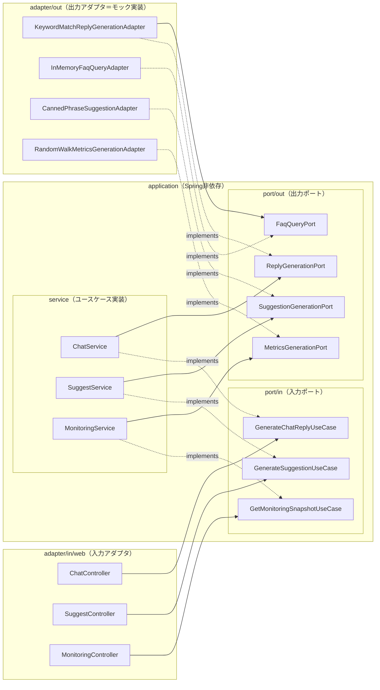

# like_chatgpt

ChatGPT風のチャットUIを試作するプロジェクトです。バックエンドは`POST /api/chat`で構造化JSON応答（`{reply, components[]}`）を返すキーワードマッチのモック実装で、メッセージ内容に応じて表や棒グラフを含む応答を生成します。応答JSONのスキーマ詳細は`docs/api/chat-response-schema.md`を参照してください。

## バックエンドのアーキテクチャ

バックエンド（`com.example.chatbackend`）はヘキサゴナルアーキテクチャ（port & adapter）で構成しています。将来モック実装を実LLM連携やDB/CMSに差し替える際、ユースケース層に手を入れずアダプタの追加・交換だけで済ませることが目的です。

各レイヤの役割:

- `domain/` — ドメインモデル（`ChatResponse`、UIコンポーネント、FAQ、モニタリングスナップショット等のrecord群）。どのレイヤにも依存しない。
- `application/port/in/` — 入力ポート（ユースケースのインターフェース）。Controllerはここにだけ依存する。
- `application/port/out/` — 出力ポート（応答生成・FAQ取得・候補生成・メトリクス生成のインターフェース）。
- `application/service/` — ユースケース実装。Spring非依存の純粋なJavaクラスで、出力ポートに委譲する薄い層。
- `adapter/in/web/` — REST Controller（入力アダプタ）。
- `adapter/out/` — 出力ポートの実装（現在はすべてモック実装。キーワードマッチ応答・ハードコードFAQ・定型文補完・ランダムウォークメトリクス）。
- `config/` — `ApplicationConfiguration` がユースケース実装をSpring Beanとして明示的に配線する。

### 依存関係グラフ

実線は「依存（呼び出し）」、点線は「インターフェースの実装」です。すべてのレイヤは `domain` のモデルを利用でき、`domain` は何にも依存しません。



依存方向のルール（domainは他レイヤに依存しない / applicationはadapterに依存しない / Spring依存はadapterとconfigに限る）は、ArchUnitテスト（`backend/src/test/java/com/example/chatbackend/architecture/ArchitectureTest.java`）で自動検証しています。

例えば実LLM連携を追加する場合は、`ReplyGenerationPort` を実装する新しいアダプタを `adapter/out/` に作成して `config` で差し替えるだけで、Controller・ユースケース層は無変更で済みます。

## 前提ツール

- Node.js
- JDK 21以上が動作するJDK

Maven CLIをローカルにインストールする必要はありません。Maven Wrapper（`mvnw` / `mvnw.cmd`）を同梱しています。

## バックエンド起動手順

```bash
cd backend
./mvnw.cmd spring-boot:run
```

（Windows/Git Bash想定です。macOS/Linuxの場合は `./mvnw spring-boot:run` を使用してください。）

起動後、`http://localhost:8080` で待受けます。

## フロントエンド起動手順

```bash
cd frontend
npm install
npm run dev
```

起動後、`http://localhost:5173` にアクセスします。

## 疎通確認方法

バックエンドとフロントエンドを両方起動した状態でブラウザから `http://localhost:5173` を開き、メッセージを送信します。例えば「今月の問い合わせ件数を担当者別にまとめて」と送信すると、担当者別の集計結果が表と棒グラフで吹き出し内に表示されます（「カテゴリ」「種別」を含む文言ではカテゴリ別の集計、それ以外の文言では使い方の案内テキストが表示されます）。想定通りの応答が表示されれば疎通確認は完了です。

## 会話の保存について

会話はブラウザのlocalStorageに自動保存され、リロード後も復元されます。サイドバーの各会話にマウスを乗せると表示されるボタンから、会話名の変更（✎）と削除（✕）ができます。

## スコープ外

認証機能、実際のLLMとの連携は本プロジェクトのスコープ外です。
